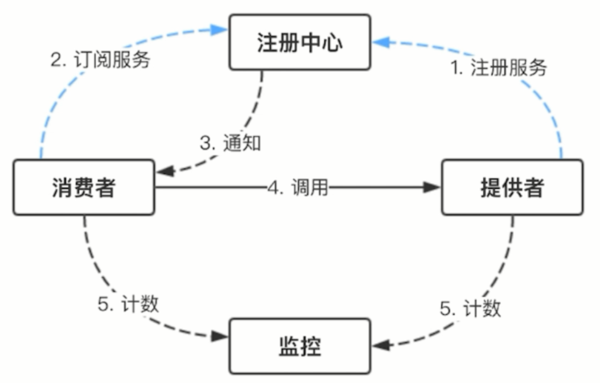
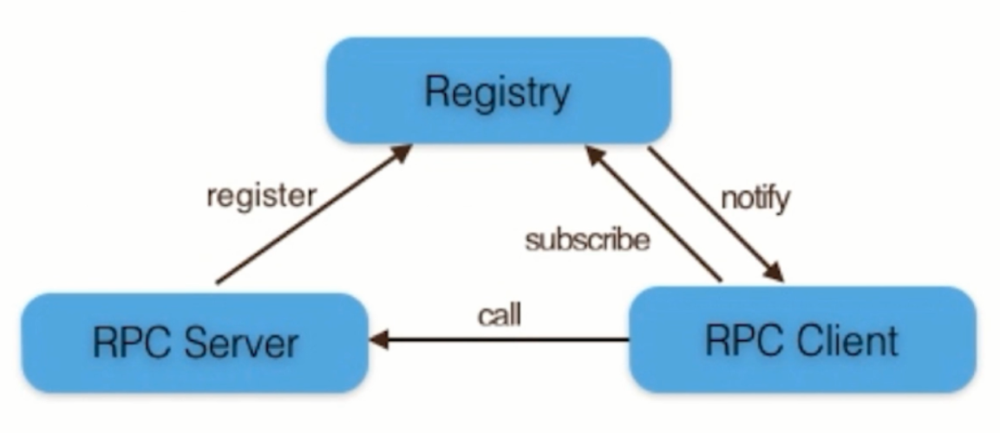
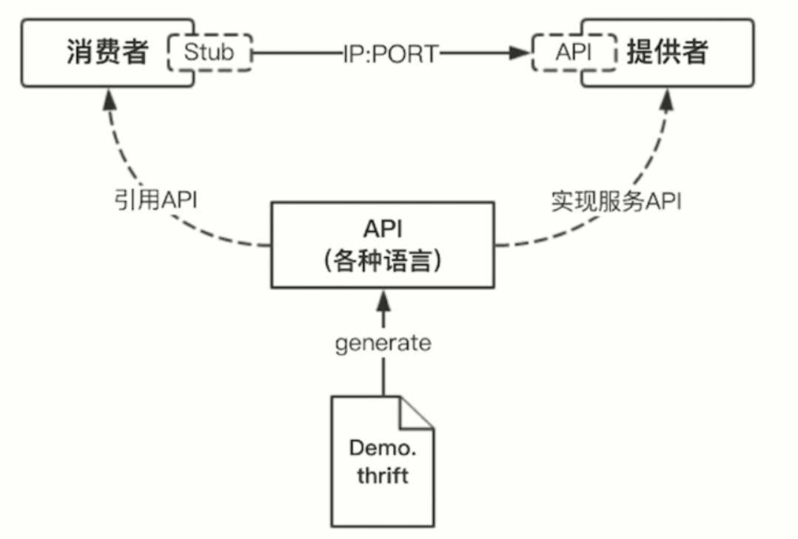
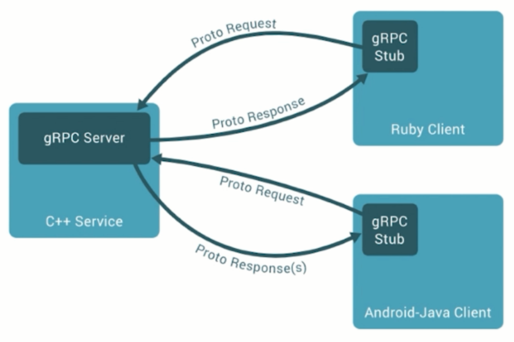
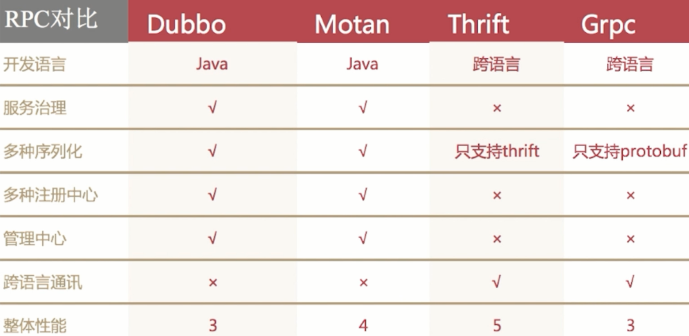
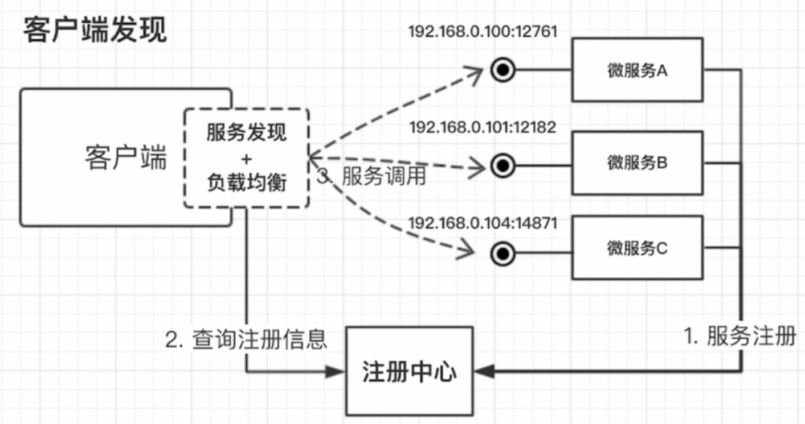
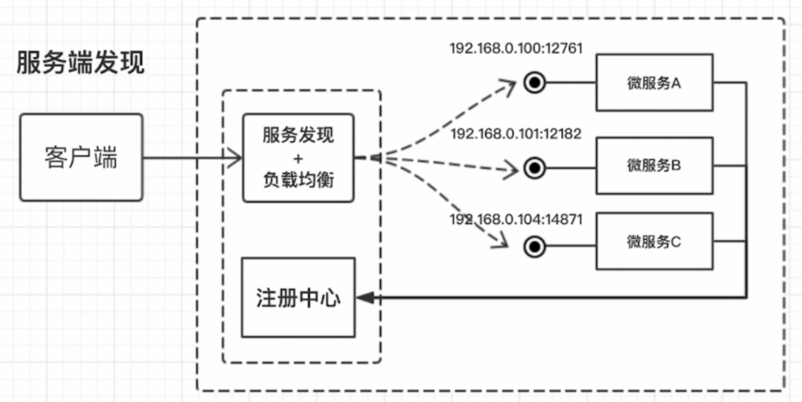

### 软件架构
软件架构是在软件的内部，经过综合各种因素的考量、权衡，选择特定的技术，将系统划分成不同的部分并使这些部分相互分工，彼此协作，为用户提供需要的价值。

#### 软件架构影响因素
- 业务需求：需要实现的功能
- 技术栈：选择用于实现功能的技术
- 成本：愿意为开发软件付出的价值
- 组织架构：有哪些部门能为开发提供帮助
- 可扩展性：面向扩展开放
- 可维护性：维护成本

#### 软件架构进化
##### 单体架构
单体架构功能、业务集中在一个发布包里，部署运行在同一个进程中。
- 优势：易于开发、测试、部署、水平扩展
- 劣势：代码膨胀而难以维护，构建、部署成本大，上手周期长，升级现有技术栈困难，对资源的不同需求导致扩展性差
##### 微服务架构
使用一套小服务来开发单个应用的方式，每个服务运行在独立的进程里，一般采用轻量级的通讯机制互联，并且它们可以通过自动化的方式部署。

### 微服务
#### 诞生背景
- 互联网行业快速发展
- 敏捷开发，精益方法深入人心
- 容器技术的成熟
#### 特征
- 单一职责：只把紧密相关的业务放在一起，无关的业务独立出去
- 轻量级通信：微服务之间的通信应该是轻量级的，平台无关，语言无关
- 隔离性：每个微服务运行在自己的进程中，不会相互干扰
- 有自己的数据：有独立的数据存储系统
- 技术多样性：开发人员选用自己擅长的技术栈
#### 优势
- 独立性：微服务构建、部署、扩容、缩容、容错甚至数据库都是独立的
- 敏捷性：微服务功能单一，API简单，迭代方便
- 技术栈灵活：在保证提供稳定服务的情况下微服务各个模块可以自由选择技术栈
- 高效团队：每个团队负责自己的微服务，提高开发效率
#### 不足
- 额外工作：微服务需要考虑如何拆分系统，而单体架构不需要
- 数据一致性：单体架构可能只有一个数据库，通过事务可以保证数据一致性，而微服务有多个数据库
- 沟通成本：服务的提供方和调用方可能属于多个团队，增加了沟通成本
#### 微服务架构引入的问题
##### 通讯
###### 从通讯协议角度考虑
- REST API
- RPC
- MQ
###### 选择RPC框架考虑因素
- I/O、线程调度模型
- 序列化方式
- 是否需要多语言支持
###### 常见RPC框架






##### 发现
- 客户端发现


- 服务端发现


##### 部署
传统部署可能通过jenkins脚本上传代码来部署，微服务随着数量增多，传统部署方式部署困难，需要引入服务编排工具，如Mesos、Docker Swarm、Kubernetes

#### SpringBoot与微服务
##### SpringBoot核心功能
- 独立运行
- 内嵌web服务器
- 简化配置
- 准生产的应用监控

### 故障
#### MySQL默认禁止远程连接
MySQL默认禁止远程连接，需要配置docker容器连接用户的远程连接权限。
```
grant all privileges on *.* to 'root'@'%' identified by 'pwd';
flush privileges;
# 查看指定用户是否改为不限制IP登录
SELECT user, host FROM mysql.user;
```
#### redis-windows默认绑定本地
在redis配置文件中，配置 bind 127.0.0.1 表示redis限制本地连接，windows版本默认是开启的，docker容器进行连接时需要注释此配置、
#### redis设置密码错误
拉取的redis镜像默认没有配置密码，若配置文件中填写了密码进行连接会保错。在上docker版本的配置文件中通过配置默认值，即：
```
spring.redis.password=
```
来覆盖密码配置。